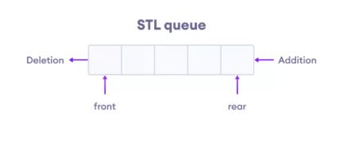
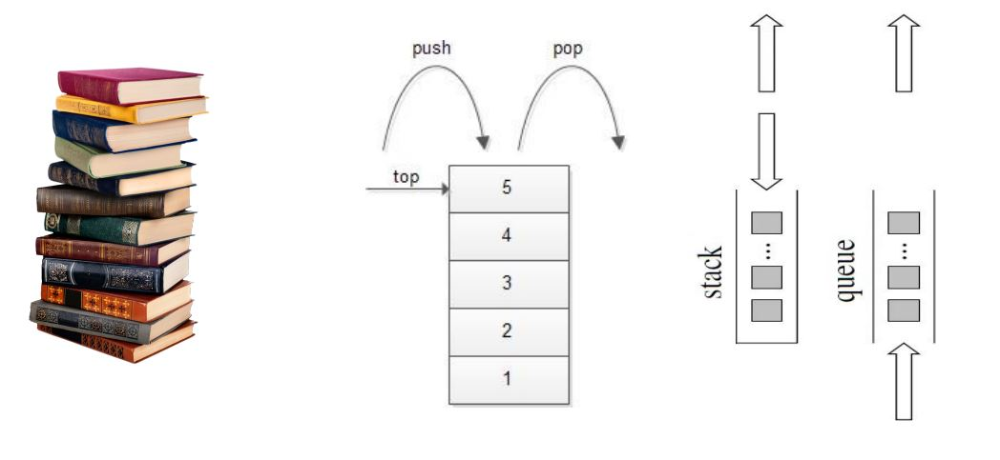
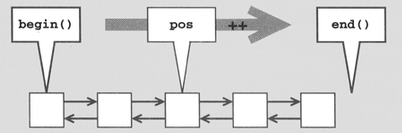
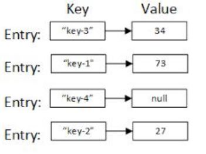

## STL Intro

### Computer Science Basics

The 4 core fundementals topics in CS

- Programming
- Data Structures
- Algorithms
- OOP
  **Other cs cores**
- Software Engineering
- Design Patterns
- Databases
- Operating System
- Networking

### Recall Queue Data Structure

It has internally an array and support following operations

```cpp
int main()
{
    queue my_queue;
    myqueue.add_end(10);
    myqueue.add_end(20);
    myqueue.add_end(30);
    myqueue.print();

    myqueue.add_front(1);
    myqueue.add_front(4);
    myqueue.print();

    cout<<myqueue.remove_front();
    return 0;
}

```

### Data Structure comes in practice

- In many cases, you will need to organize, process and retrieve data in some
  specific way, similar to our queue
- You typically define a class, inside it data (e.g. array) and operations on data
- We call this class a data structure
- In practice, same data structure needs repeat.
  - This is what a data structure course teaches
    - Basic structures: queue, dequeue, stack, vector, linked list, binary search tree
    - Advanced: Has table, balanced binary search tree, trie, segment tree

#### STL - Standard Template Library

- conatiners: Implemented very efficient data structures to directly use
- Using templates: Generic containers
- STL also provides set of algorithms to act on these containers

- Learning them = makes studying data structures course easier


---

## STL Queue



- Based on First in first out strategy (FIFO)
- But we need queue for several data types: Integer, Double, Employees?
  - Use C++ templates
  - queue<int> q_int;
  - queue<employee> q_empl;
- What does it support?
  - Push (to add element)
  - Front (to get top element)
  - Empty (to know if empty() )
  - Size(): How many elements?

---

### Priority Queue:

Make them sorted

```cpp
#include<iostream>
#include<queue>
using namespace std;

void print(priority_queue <int> &pq) {
  cout << "priority Queue elements: ";
  while(!pq.empty()) {
    cout<< pq.top() << " ";
    pq.pop();
  }
  cout << "\n";
}

int main()
{
    // order from big to small
    priority_queue<int> pq;
    pq.push(3);  // 3
    pq.push(5);  // 5 3
    pq.push(1);  // 5 3 1
    pq.push(7);  // 7 5 3 1
    pq.push(0);  // 7 5 3 1 0

    print(pq); // use -ve number to sort from small to large(Ascending)
    return 0;
}
```

---

### Deque

```cpp

#include <iostream>
#include<deque>
using namespace std;


int main()
{
    deque<int> q;
    q.push_back(20);  // q: 20
    q.push_back(30);  // q: 20 30
    q.push_back(40);  // q: 20 30 40
    q.push_front(10); // q: 10 20 30 40
    q.push_back(50);  // q: 10 20 30 40 50
    q.push_front(0);  // q: 0 10 20 30 40 50

  return 0;
}
```

---

### Stack

Imagine dishes and you put dish by dish



```cpp
#include <iostream>
#include<stack>
using namespace std;

void print(stack<string> &s) {
  cout << "Stack elements: ";
  while(!s.empty()) {
    cout << s.top() << " ";
    s.pop();
  }
  cout << "\n";
}

int main()
{
  stack<string> s;
  s.push("Elgarnousy");
  s.push("Kamal");
  s.push("Ahmed");

  print(s);      // Ahmed Kamal Elgarnousy

  return 0;
}
```

---

### STL Pair

```cpp
#include <iostream>
#include <utility>  // for pair
#include <stack>
using namespace std;

int main() {

    pair<int, string> p = make_pair(10, "saad");

    stack<pair<int, string>> s;
    s.push(p);
    s.push(p);

    pair<int, pair<int, string>> my_p = make_pair(10, make_pair(20, "ali"));
    my_p = make_pair(18, p1);

    return 0;
}
```

- **Pair: Comparison**
- Let’s say we have pair<int, pair<string, int> >
  - P1 = (10, (mostafa, 35))
  - P2 = (7, (ali, 15))
  - P3 = (10, (ziad, 17))
  - P4 = (10, (mostafa, 20))
- Comparing pair order on first element, then on second element

---

### STL Tuple

A generalization of pair

```cpp
#include <iostream>
#include <tuple>
using namespace std;

int main()
{
  tuple<char, int, string> t1;
  t1 = make_tuple('c', 10, "ahmed");

  // Get<position> c, 10
  cout << get<0>(t1) << " " << get<1>(t1) << "\n";

  // Set<position>
  get<0>(t1) = 'd';

  cout << (t1 <= t1) << "\n"; // we can compare tuples

  char ch;
  char val;
  string name;

  // tie: unpack the tuple values into separate variables
  tie(ch, val, name) = t1;
  cout << name << "\n";

  // concatenating 2 tuples to return a new tuple  (rarely used)
  auto t2 = tuple_cat(t1, make_tuple(10.6));

  // c++17 some nicer sytnax. Don't try unless c++17 compilation
  int c, d;

  // auto [c, d] = std::make_tuple(4, 5);

  return 0;
}

```

---

### STL Iterators

### Recall printing Deque

- We can print forward or backward: e.g. .front, .pop_front

```cpp

void print_front(deque<int> &q) {
  cout<< "Queue elements (front): ";
  while(!q.empty()) {
    cout<<q.front() << " ";
    q.pop_front();
  }
  cout<< "\n";
}

int main()
{
    deque<int> dq {1,2,3,4,5};
    print_front(dq); // 1 2 3 4 5
    return 0;
}
```

- But I don’t want it to be freed to delete?
  - Ok Don’t use &. Make a copy
  - But this is waste of time and memory?
  - `So Use iterators`!

### Iterators

deque<int>::iterator it = dq.begin();

- Iterator is an object, but think of it like a position in an array
  - begin() = first element
  - end() = AFTER last element
- Moving forward/backward: use ++pos, --pos
- Want the current value? \*pos
  - You can print / change



### Using iterators: Iterate forward

```cpp

void print_front(deque<int> &q) {
  cout << "Queue elements (front): ";

  deque<int>::iterator it  = q.begin();

  while(it != q.end()) {
      cout<<*it<<" ";
      it ++;
  }
  cout<<"\n";
}

int main()
{
    deque<int> dq {1,2,3,4,5};
    print_front(dq); // 1 2 3 4 5
    return 0;
}
```

### Using iterators: Iterate backward

- To iterate backward we use `rbegin` (r for reverse)
- Think of it as if the content is reversed
- So u again u can move with `++`

```cpp
void print_back1(deque<int> &q) {
  cout << "Queue elements (back): ";

  deque<int>::reverse_iterator rit  = q.rbegin();
  while(rit != q.rend()) {
      cout<<*rit<<" ";
      rit ++;
  }
  cout<<"\n";
}

void print_back2(deque<int> &q) {
    cout << "Queue elements (back): ";

    for(auto it = q.rbegin(); it != q.rend() ; it ++ )
      cout<<*it<<" ";

    cout<<"\n";
}

```

#### Iterator Arithmetic

```cpp
void lets_play() {
  deque<int> q {1,2,3,4,5};

  auto it = q.begin() + 3;  // Forth element position
  cout << *it << "\n";      // 4

  cout << *(it --) << "\n";  // 4 then move to 3rd position
  cout << *it << "\n";       // 3

  cout << *(-- it) << "\n";   //2
  cout << *it << "\n";        // now on 2nd

  cout << *(it + 3) << "\n";   // 5th position
  it += 3;
  cout << *it << "\n";        // 2 now on 5th position

  // reset all to 10
  for(auto it = q.begin(); it != q.end(); ++it) {
    *it = 10;
  }
}
```

#### const_iterator

- `cbegin` / `cend` instead of `begin` / `end`
- same as we did, just iterator is const,
- But you can’t change value while iterating
  - Good for communicating intentions
- Similarly: crbegin, crend

```cpp

void print_front_const (deque<int> &q) {
  cout << "Queue elements (front): ";

  deque<int>::const_iterator it = q.cbegin();
  while(it != q.cend()) {
    cout << *it << " ";
    // *it = 10;     // can't - CONST
    ++it;
  }

  cout << "\n";
}
```

### some containers Can't iterator

- can’t iterate on `stack`, `queue`, `priority_queue`
- but other ok let’s iterate on string
- E.g. string::iterator it;

```cpp
int cout_lowers(const string & str) {
  int cnt = 0;
  for(auto it = str.begin(); it != str.end(); ++it) {
    char ch = *it;
    cout<<ch;
    cnt += (islower(ch) > 0);
  }
  return cnt;
}
```

### next

```cpp
void more(){
    vector<int>::iterator it1;
    set<string>::iterator it2;

    //Each item is: pair<int,string>
    map<int, string>::iterator it3;
}
```

---

## Range based loop

### auto

```cpp
void what_is_auto(){
    int x1 = 10;
    auto x2 = 10; // c++ deduces int
    auto x3 = 10.0; // double
    auto x4 = "ahmed"; // string
    // There are more details. This is good for now
    // Auto: No conversion / clean code
}
```

### c++ 11 Iterating Style

```cpp

    int arr[] {1,2,3};

    for(auto val : arr)  // copy not reference
      cout<< val << " ";
    cout<<"\n";

    deque<int> q {1,2,3,4,5};
    for(const auto &val : q)   // most perfered way to iterate with reference less time
      cout<< val << " ";
    cout<<"\n";

    for(auto val : {1,2,3,4,5})
      cout<< val << " ";
    cout<<"\n";


    for(auto val : "hello"){
        cout<< val << " ";
    }

```

---

## vector

```cpp
void test1() {
   vector<int> v1; // Array thta can be expanded

    cout<<"size is "<<v1.size()<<"\n";
    for(int i = 0; i < (int)v1.size() -1; i++)
    {
      cout << v1[i] <<" ";
    }

    v1.push_back(30);
    v1.push_back(10);
    v1.push_back(20);

    for(int i = 0; i < (int)v1.size(); i++) {
        cout<< v1[i] << " ";     // 30 10 20
    }
    cout<<"\n";

    vector<int> v2(5, 7);
    // Like an array with 5 numbers all initialized with 7

    v2.push_back(13); // now add extra num = 13

    for(auto &val : v2) {
      cout<< val<< " ";
    }
    cout<<"\n";

    vector<int> vec ;

  // v2.at(1000); exception
  // Later: emplace_back
}

void test2() {
   vector<int> vec {3, -4, 7, -2, -1, 3, -5, 10, 3};

    // let's remove negative values   (slow operation)
    for(auto it = vec.begin(); it != vec.end(); ) {
        if(*it < 0)
        {
          // You must use the returned iterators as erase invalidates it
          // working on some cases != working all cases/data strutures
          it = vec.erase(it);
          // It points to next element. Don't increment it
        }
        else
            ++it;  // update ONLY if not removed
    }
    // 3 7 3 10 3
    for(auto &val : vec)
      cout<< val << " ";
}

void test3() {
  vector<int> v {3, -4, 7, -2, -1, 3, -5, 10, 3};

  // find is an algorithm. see algorithms video
  auto it = find(v.begin(), v.end(), -2);

  if(it != v.end()) {
      vector<int> v2 {8, 9 , 10};
      v.insert(it, v2.begin() , v2.end());
  }
  // 3 -4 7 8 9 10 -2 -1 3 -5 10 3
  for(auto &val : v)
    cout<< val << " ";
}

```

### How vector works? Capacity Trick

- Inside the vector there is an array of some size. Let’s call it int capacity
  - E.g. Initially capacity = 200;
- Let’s say you push_back 10 elements
  - Now size = 10. Capacity is 200
- Let’s say you pushed another 190 elements
  - Now size = capacity = 200
- Let’s add another 20 elements
  - Vector creates a new array with some bigger capacity, e.g. capacity = 400
  - Copy old 100 elements. Add new 20 elements. Now: size = 220. Capacity = 400
- Performance Tips
  - Pushing a lot is expensive. Know size? vector<int> v(1000000);
  - Know initial possible growth and seems big value? vector<int> v; v.reserve(50000);

---

## 2D vector

```cpp
void test1() {
  vector<string> matrix {"mostafa", "ali", "me"};

  // string is 1D array of chars

  // what about vector<string>?
  // matrix of 3 rows, each one has dynamic columms
  // mostafa
  // ali
  // me
  cout<<matrix.size()<<"\n";    // 3 rows

  int rows = matrix.size();
  for(int i = 0; i < rows ; ++i) {
    // Dynamic colum sizes : 7 3 2
    cout<< matrix[i].size() <<" ";
  }

}
```

```cpp
void print(vector<vector<int>> &v2d) {
  for (auto &row : v2d)     // auto = vector<int>
  {
    for(auto &col : row){
      cout<< col << " ";
    }
      cout<<"\n";
  }
      cout<<"\n\n";
}

void test2() {
  // 2D Array using vector
  // (2, 5) 2d array
  vector<int> row(5,1);    // 5 numbers, each  is 1

  // 3 rows: each is 5 values of 1
  vector<vector<int> > v2d(3, row);

  print(v2d);

  int rows = v2d.size(), cols = v2d[0].size();         // 3 5

  v2d[0][0]  = 9;
  v2d[1].push_back(5);
  v2d[1].push_back(6);
  v2d[2].erase(v2d[2].begin());

  print(v2d);

}
```

### 3D Vector

```cpp
void test3()
{
  // 3D Array using vector
  // (5,7)2d  array with initial value 3
  vector<vector<vector<int>>> v3d(5, vector<vector<int>>(6, vector<int>(7)));

  // 5 x 6 x 7
  cout << v3d.size() << " " << v3d[0].size() << " " << v3d[0][0] << "\n";
  for (int i = 0; i < v3d.size(); i++)
  {
    print(v3d[i]); // print 2d vec
  }
}
```

---

## string

```cpp
#include<iostream>
#include<bits/stdc++.h>
using namespace std;

int main() {

    string test = "hi abc abc abc ";

    cout<< test.substr(3) << "\n"; // abc abc abc abc
    cout<< test.substr(3,5) << "\n";  // abc

    cout<< test.find("abc") << "\n";  // 3

    // starting the search at 6th character
    cout<< test.find("abc", 5) << "\n";  // 7

    cout<< "Mostafa at: "<< test.find("Mostafa") << "\n";  // 18446744073709551615 (unsigned)
    cout<< "Mostafa at: "<< (int)test.find("Mostafa") << "\n";  // -1

    // functions that searches for a CHARACTER  from a given string
    cout<< test.find_last_of("cab") << "\n";        // 17
    cout<< test.find_first_of("aib") << "\n";       // 1
    cout<< test.find_first_of("aic", 4) << "\n";    // 5
    cout<< test.find_first_not_of("aic") << "\n";   // 0

    // replace fom 4, 3 chars with x
    test.replace(4,3,"x");
    cout<<test<<"\n";         // hi axabc abc abc

  return 0;
}
```

---

## Algorithms

##### sort

```cpp
    vector<int> v(5);

    for(int i = 0; i <(int)v.size(); i++)
        v[i] = 10 -i;

    print(v); // 10 9 8 7 6

    sort(v.begin() +1, v.end());

    print(v); // 10 6 7 8 9

    sort(v.begin(), v.end());
    print(v); // 6 7 8 9 10

    sort(v.rbegin(), v.rend());
    print(v); // 10 9 8 7 6

```

##### reverse

```cpp
    reverse(v.begin(), v.end());
    print(v); //  6 7 8 9 10

    v.clear(); // now empty vector
```

---

## set

- ==set== remain items ==sorted== and ==unique==
- remember priority_queue keep also items sorted but
- set provide much more functionalilties
- my_set.count() method slower way
- my_set.find() is much faster returns an iterator

```cpp
#include<set> // set and multiset
```

```cpp

    set<string> strSet; // sorted and unique
    strSet.insert("zaid");
    strSet.insert("mostafa");
    strSet.insert("mostafa");
    strSet.insert("mostafa");
    strSet.insert("ahmed");

    print(strSet); // ahmed mostafa zaid

    // set<string>::iterator it = strSet.find("mostafa");
    auto it = strSet.find("mostafa"); // shorter way
    if (it != strSet.end())
        strSet.erase(it);

    print(strSet); // ahmed zaid
```

### multiset

- same as set but allow dublicates (multi)

```cpp
    multiset<string> strMSet;
    strMSet.insert("kamal");
    strMSet.insert("ahmed");
    strMSet.insert("ahmed");
    strMSet.insert("ahmed");
    strMSet.insert("hussin");

    print(strMSet); //  ahmed ahmed ahmed hussin kamal

    cout << strMSet.count("ahmed") << "\n"; // 3

    auto it = strMSet.find("ahmed"); // for shorter code
    if (it != strMSet.end())
        strMSet.erase(it);

    print(strMSet); //  ahmed ahmed hussin kamal
```

### if we have a set of employee how cpp ordered them?!

- we `have to provide` a operator less than function `<`
- there are 3 ways to compare
  - normal way : with the variables
  - pair: make_pair()
  - std::tie : to use tie must be varaibles

```cpp
#include <iostream>
#include <set>   // set and multiset
#include <tuple> // tie

using namespace std;

struct employee
{
    int num1, num2;
    string str;

    employee(int a, int b, string name) : num1(a), num2(b), str(name)
    {
    }

    bool operator<(const employee &rhs) const
    {
        // way1: compare as we did before
        if (num1 != rhs.num1)
            return num1 < rhs.num1;

        if (str != rhs.str)
            return str < rhs.str;

        return num2 < rhs.num2;

        // way2:  or use pair
        return make_pair(num1, make_pair(str, num2)) < make_pair(rhs.num1, make_pair(rhs.str, rhs.num2));

        // way3: to use tie: must be variables
        // return std::tie(num1, str, num2) < std::tie(rhs.num1, rhs.str, rhs.num2);
    }
};

int main()
{
    set<employee> s_emp;
    s_emp.insert(employee(10, 35, "mostafa"));
    s_emp.insert(employee(7, 15, "ali"));
    s_emp.insert(employee(10, 17, "zaid"));
    s_emp.insert(employee(10, 20, "mostafa"));

    for (auto emp : s_emp)
        cout << emp.num1 << " " << emp.str << " " << emp.num2 << "\n";

    /*
        7 ahmed 20
        10 mostafa 20
        10 mostafa 35
        10 zaid 17
    */
    return 0;
}
```

```cpp

```

---

## unorderd_set

- unsorted and unique
- Not mutable (CAN'T Change values)
- No reverse iterator
- unordered_multiset: same but allows duplicates
- unordered set is very fast operations (erase,find) compared to set , map, vector
- it based on hashtable

```cpp
int main(){
    unordered_set<int> s1 {20, 10, 20, 5, 30};
    s1.insert(7);
    s1.insert(0);

    for (auto v : s1)
        cout<< v << " ";
    cout<<"\n";  // 0 7 20 10 5 30 : removed duplicates

    // if container has amethod use it
    // as it considers the internal representation

    auto it1 = s1.find(20);  // FAST
    cout << *it1 << "\n";
    // *it = 20;         // CAN'T change

    // generic algorithms iterate in gereric/same way
    // no idea about internals representation

    auto it2 = find(s1.begin(), s1.end(), 20);   // SLOW
    cout<< *it2 << "\n";

    cout << s1.size() << "\n";  // 6
    s1.erase(s1.begin());
    cout<< s1.size()<< "\n";   // 5

  return 0
}
```

### valid initailzation

```cpp
    int arr[]{20, 10, 20, 5, 30, 7, 0};
    unordered_set<int> s2(arr, arr + 3);

    s1.swap(s2); // swapping operation: 0 7 30 5 10 20

    set<int> sorteds(s1.begin(), s1.end()); // 5 7 10 20 30
```

---

## map

## 

- array is a DS that its elemets accessed by index(zero-based)
- what if we want DS that can access its elements by string , negative numbers , doubles , etc.
- Map is very usefull data structure.

```cpp
#include <iostream>
#include <map>
using namespace std;

void print(map<string, int> &mp)
{
    // for (pair<string, int> item : mp)
    // for (const pair<string, int> &item : mp)
    for (auto &item : mp)
        cout << item.first << " " << item.second << "\n";
    cout << "\n";
}

int main()
{
    map<string, int> mp;

    mp["ahmed"] = 20;
    mp["ahmed"] = 23;
    mp["mostafa"] = 28;
    mp["mohamed"] = 30;
    mp["mohand"] = 16;
    mp["bamal"] = 62;
    mp["zaid"] = 11;
    mp["wafaa"] = 51;

    print(mp);
    cout << mp.count("ahmed") << "\n";

    auto it = mp.find("zaid");

    mp.erase(it);
    mp.erase("ahmed");

    print(mp);

    return 0;
}
```

#### is it copy or reference

```cpp
    map<char, vector<int>> my_data;

    vector<int> x;
    x.push_back(1);
    x.push_back(2);
    x.push_back(3);

    my_data['A'] = x;
    x.push_back(4);

    cout << my_data['A'].size() << "\n"; // 3
    cout << x.size() << "\n";            // 4  (so we have 2 copies)

    vector<int> x2 = my_data['A'];  // 3rd copy
    vector<int> &x3 = my_data['A']; // same memory

```
